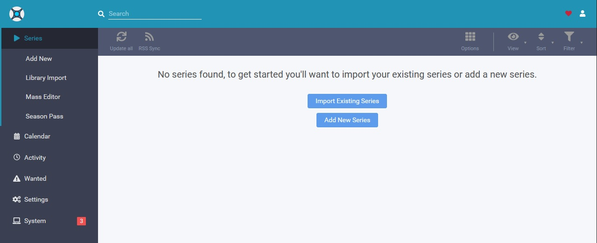

<!--
N.B.: This README was automatically generated by https://github.com/YunoHost/apps/tree/master/tools/README-generator
It shall NOT be edited by hand.
-->

# Sonarr for YunoHost

[](https://dash.yunohost.org/appci/app/sonarr)    
[](https://install-app.yunohost.org/?app=sonarr)

*[Lire ce readme en français.](./README_fr.md)*

> *This package allows you to install Sonarr quickly and simply on a YunoHost server.
If you don't have YunoHost, please consult [the guide](https://yunohost.org/#/install) to learn how to install it.*

## Overview

A series collection manager for Usenet and BitTorrent users.

**Shipped version:** 3.0.6.1196~ynh1


## Screenshots



## Disclaimers / important information

* Sonarr developper's repository only allows to download the very latest version.
  * The version displayed here may be different from the one actually installed.
* Supported architectures are `arm`, `armhf`, `arm64`, and `amd64`
* Access control is done with YunoHost's permissions system.
  * API (`domain.tld/path/api`) can be accessed by visitors to allow control by remote clients.
* The app uses YunoHost's multimedia directories, hence it has write access to users' and shared directories in `/home/yunohost.multimedia`. After installation, you can choose these directories to store your media.

## Documentation and resources

* Official app website: https://sonarr.tv
* Official admin documentation: https://wiki.servarr.com/Sonarr
* Upstream app code repository: https://github.com/Sonarr/Sonarr
* YunoHost documentation for this app: https://yunohost.org/app_sonarr
* Report a bug: https://github.com/YunoHost-Apps/sonarr_ynh/issues

## Developer info

Please send your pull request to the [testing branch](https://github.com/YunoHost-Apps/sonarr_ynh/tree/testing).

To try the testing branch, please proceed like that.
```
sudo yunohost app install https://github.com/YunoHost-Apps/sonarr_ynh/tree/testing --debug
or
sudo yunohost app upgrade sonarr -u https://github.com/YunoHost-Apps/sonarr_ynh/tree/testing --debug
```

**More info regarding app packaging:** https://yunohost.org/packaging_apps