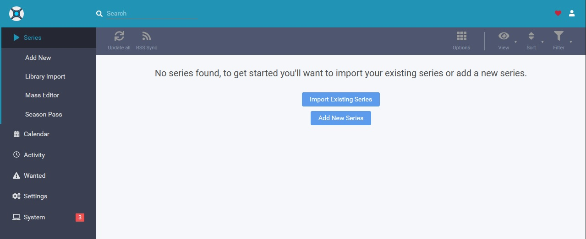

<!--
NB: Deze README is automatisch gegenereerd door <https://github.com/YunoHost/apps/tree/master/tools/readme_generator>
Hij mag NIET handmatig aangepast worden.
-->

# Sonarr voor Yunohost

[](https://ci-apps.yunohost.org/ci/apps/sonarr/)


[](https://install-app.yunohost.org/?app=sonarr)

*[Deze README in een andere taal lezen.](./ALL_README.md)*

> *Met dit pakket kun je Sonarr snel en eenvoudig op een YunoHost-server installeren.*  
> *Als je nog geen YunoHost hebt, lees dan [de installatiehandleiding](https://yunohost.org/install), om te zien hoe je 'm installeert.*

## Overzicht

Sonarr is a PVR for Usenet and BitTorrent users. It can monitor multiple RSS feeds for new episodes of your favorite shows and will grab, sort and rename them. It can also be configured to automatically upgrade the quality of files already downloaded when a better quality format becomes available.


**Geleverde versie:** 4.0.14.2939~ynh1

## Schermafdrukken



## Documentatie en bronnen

- Officiele website van de app: <https://sonarr.tv>
- Officiele beheerdersdocumentatie: <https://wiki.servarr.com/Sonarr>
- Upstream app codedepot: <https://github.com/Sonarr/Sonarr>
- YunoHost-store: <https://apps.yunohost.org/app/sonarr>
- Meld een bug: <https://github.com/YunoHost-Apps/sonarr_ynh/issues>

## Ontwikkelaarsinformatie

Stuur je pull request alsjeblieft naar de [`testing`-branch](https://github.com/YunoHost-Apps/sonarr_ynh/tree/testing).

Om de `testing`-branch uit te proberen, ga als volgt te werk:

```bash
sudo yunohost app install https://github.com/YunoHost-Apps/sonarr_ynh/tree/testing --debug
of
sudo yunohost app upgrade sonarr -u https://github.com/YunoHost-Apps/sonarr_ynh/tree/testing --debug
```

**Verdere informatie over app-packaging:** <https://yunohost.org/packaging_apps>
